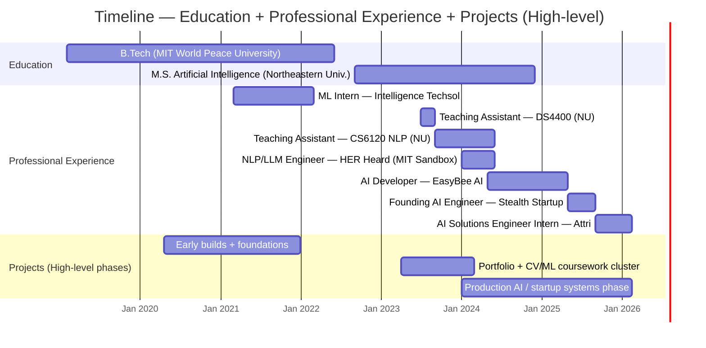
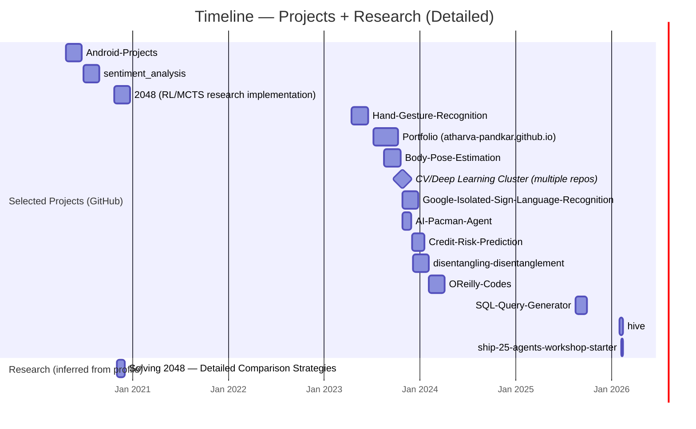

  

    
    
  

# Timeline View

This page is optimized for understanding overlap across **education**, **professional experience**, and **projects/research**.

---

## 1) Education + Professional Experience + Projects (High-level)

---

## 2) Projects + Research (Detailed)

> Repo start dates come from your chronological repo list; durations are **best-effort inferred** unless an end date is explicit.

---

## Repository Timeline (Chronological)

  

    All public repositories in chronological order (as listed)
  

  
<code style="color:#7DD3FC;">2020-04-20</code><a href="https://github.com/Atharva-Pandkar/Android-Projects">Android-Projects</a>

  
<code style="color:#7DD3FC;">2020-04-20</code><a href="https://github.com/Atharva-Pandkar/Projects-Done">Projects-Done</a>

  
<code style="color:#7DD3FC;">2020-04-22</code><a href="https://github.com/Atharva-Pandkar/Competition-Problems-Solution">Competition-Problems-Solution</a>

  
<code style="color:#7DD3FC;">2020-06-25</code><a href="https://github.com/Atharva-Pandkar/sentiment_analysis">sentiment_analysis</a>

  
<code style="color:#7DD3FC;">2020-10-20</code><a href="https://github.com/Atharva-Pandkar/2048">2048</a>

  
<code style="color:#7DD3FC;">2021-12-06</code><a href="https://github.com/Atharva-Pandkar/WeatherApp">WeatherApp</a>

  
<code style="color:#7DD3FC;">2023-04-12</code><a href="https://github.com/Atharva-Pandkar/Atharva-Pandkar">Atharva-Pandkar</a>

  
<code style="color:#7DD3FC;">2023-04-17</code><a href="https://github.com/Atharva-Pandkar/Hand-Gesture-Recognition">Hand-Gesture-Recognition</a>

  
<code style="color:#7DD3FC;">2023-07-09</code><a href="https://github.com/Atharva-Pandkar/Atharva-Pandkar.github.io">Atharva-Pandkar.github.io</a>

  
<code style="color:#7DD3FC;">2023-08-19</code><a href="https://github.com/Atharva-Pandkar/Body-Pose-Estimation">Body-Pose-Estimation</a>

  
<code style="color:#7DD3FC;">2023-10-27</code><a href="https://github.com/Atharva-Pandkar/Google-Isolated-Sign-Language-Recognition">Google-Isolated-Sign-Language-Recognition</a>

  
<code style="color:#7DD3FC;">2023-10-27</code><a href="https://github.com/Atharva-Pandkar/Calibaration---Augmented-Reality">Calibaration---Augmented-Reality</a>

  
<code style="color:#7DD3FC;">2023-10-27</code><a href="https://github.com/Atharva-Pandkar/Real-Time-Filtering">Real-Time-Filtering</a>

  
<code style="color:#7DD3FC;">2023-10-27</code><a href="https://github.com/Atharva-Pandkar/Content-Based-Image-Retrival">Content-Based-Image-Retrival</a>

  
<code style="color:#7DD3FC;">2023-10-27</code><a href="https://github.com/Atharva-Pandkar/Real-Time-2D-Object-Recognition">Real-Time-2D-Object-Recognition</a>

  
<code style="color:#7DD3FC;">2023-10-27</code><a href="https://github.com/Atharva-Pandkar/Recgnition-Using-Deep-Networks">Recgnition-Using-Deep-Networks</a>

  
<code style="color:#7DD3FC;">2023-10-27</code><a href="https://github.com/Atharva-Pandkar/AI-Pacman-Agent">AI-Pacman-Agent</a>

  
<code style="color:#7DD3FC;">2023-12-04</code><a href="https://github.com/Atharva-Pandkar/Credit-Risk-Prediction">Credit-Risk-Prediction</a>

  
<code style="color:#7DD3FC;">2023-12-06</code><a href="https://github.com/Atharva-Pandkar/disentangling-disentanglement">disentangling-disentanglement</a>

  
<code style="color:#7DD3FC;">2024-02-06</code><a href="https://github.com/Atharva-Pandkar/OReilly-Codes">OReilly-Codes</a>

  
<code style="color:#7DD3FC;">2025-08-03</code><a href="https://github.com/Atharva-Pandkar/first-contributions">first-contributions</a>

  
<code style="color:#7DD3FC;">2025-08-03</code><a href="https://github.com/Atharva-Pandkar/twenty">twenty</a>

  
<code style="color:#7DD3FC;">2025-08-19</code><a href="https://github.com/Atharva-Pandkar/SQL-Query-Generator">SQL-Query-Generator</a>

  
<code style="color:#7DD3FC;">2025-08-19</code><a href="https://github.com/Atharva-Pandkar/spoken-digit-classifier">spoken-digit-classifier</a>

  
<code style="color:#7DD3FC;">2026-02-01</code><a href="https://github.com/Atharva-Pandkar/hive">hive</a>

  
<code style="color:#7DD3FC;">2026-02-08</code><a href="https://github.com/Atharva-Pandkar/ship-25-agents-workshop-starter">ship-25-agents-workshop-starter</a>

---

Back to profile: [About Me View](./GitHub-Profile-README.md)
